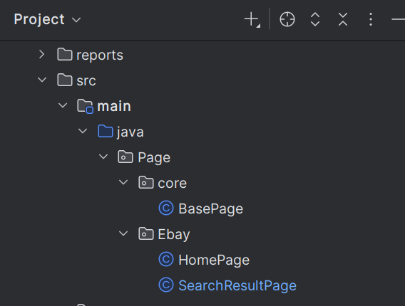
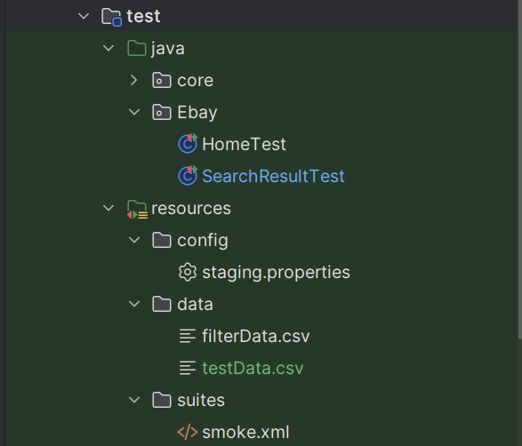

# eBay UI Automation

Automated UI testing project for eBay website using Selenium WebDriver, TestNG, and Page Object Model (POM).

---

## Tech Stack

- Java 17
- Selenium WebDriver
- TestNG
- Page Object Model (POM)
- Data Driven Testing (CSV)
- Extent Report
- Log4j
- GitHub Actions (CI)

---

## Project Structure

---

## Test Coverage

### Search Functionality
- Search product with valid keyword
- Search product with invalid keyword
- Validate keyword in URL
- Validate result heading
- Validate zero result condition

### Filter Functionality
- Apply filter
- Reset filter
- Verify filter persists after refresh

---

## Data Driven Testing

Search data stored in CSV:
src/test/resources/data/searchData.csv
Example:
keyword;category;type MacBook;Computers/Tablets & Networking;valid
asdfghjk;Computers/Tablets & Networking;invalid

---

## Reporting

Extent HTML report generated after execution:
/reports/extent-report.html
Screenshots captured for:
- Passed tests
- Failed tests

---

## How To Run

### Run via Terminal
./gradlew clean test → Run

---

## CI Pipeline

This project includes GitHub Actions CI pipeline.

On every push:
- Install Java
- Install dependencies
- Run automation tests

---

## Documentation
* [📄 Test Plan - Google Docs](https://docs.google.com/document/d/16_Wwb_va-ULXPN6BZkX2hTR2wvNHCGT4INExu9prFGc/edit?usp=sharing)
* [📊 Manual Test Case - Google Docs](https://docs.google.com/spreadsheets/d/1FgE1IiF1TqU_6AnubfBFQaNK_Nu_LL8dfTwKKqcrVu8/edit?usp=sharing)

---

## 👤 Author

Dafit Saputra Utama
Automation QA Engineer

---
